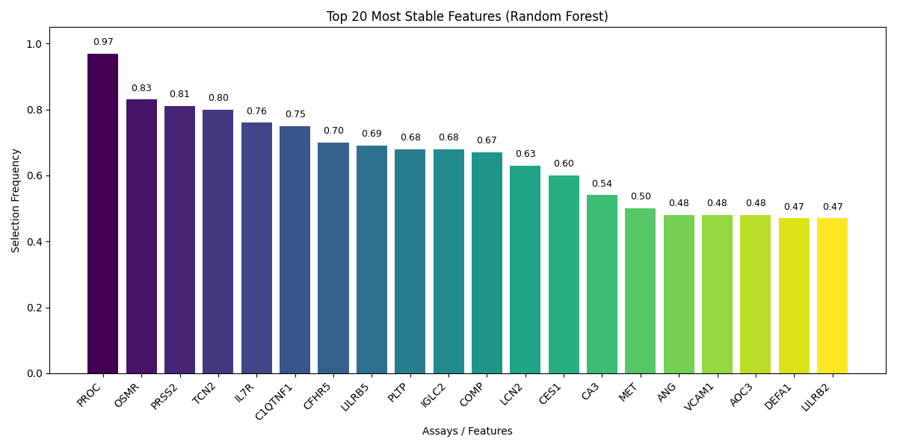

# <ins>R</ins>andom<ins>F</ins>orest-based <ins>B</ins>iomarker <ins>I</ins>mportance <ins>D</ins>iscovery (rfbid) tool for OLINK panels

**rfbid** is a Python package for analyzing OLINK proteomics assay data.  
It provides a streamlined pipeline to go from raw NPX assay files (CSV or XLSX) to biomarker discovery (wrt to importance) using Random Forests.

---

## Features

- Read OLINK proteomics data (`.csv` or `.xlsx`, `;` separated CSV supported)
- Automatically filter out control samples (`Control`, `CONTROL`)
- Select panel of interest (first panel or user-specified)
- Reshape NPX data into **samples × assays** format, with replicate aggregation (mean/median)
- Random Forest–based biomarker selection
- Publication-ready visualizations (importance plots)
- Modular **object-oriented design** for extensibility

---

## Installation

From **TestPyPI** (sandbox):

```bash
pip install -i https://test.pypi.org/simple/ --extra-index-url https://pypi.org/simple rfbid
```

An example run could be:
```bash
rfbid --input /path/to/npx_data1.csv --target Treatment --plot
```

However, to utilize the full capability of the tool. Users can customize data accoring to their need before calling *rfbid*.
Example below

```python
import json
import pandas as pd
from rfbid import __version__
from rfbid.core import preprocess_olink, pivot_assays, extract_metadata
from rfbid.core import selection_frequency, validate_markers
from rfbid.core import compute_classification_metrics, plot_selection_frequency

data = pd.read_csv("path/to/npx_data1.csv", sep=";")

data_filtered = preprocess_olink(data, panel="Olink Cardiometablomic")
X_df = pivot_assays(data_filtered)

# build meta cols excluding common assay columns
meta_cols = [col for col in data_filtered.columns if col not in ['Index', 'Assay', 'NPX', 'OlinkID', 'UniProt', 'MissingFreq', 'Panel_Version', 'PlateID', 'QC_Warning', 'LOD','Panel']]

meta_df = extract_metadata(data_filtered, meta_cols)

y = meta_df["Treatment"]

freq = selection_frequency(X_df, y, n_iter=100, top_k=30, seed=42, rf_kwargs=dict(n_estimators=200, random_state=42, n_jobs=-1))

selected = freq[freq >= 0.5].index.tolist()

with open('selected_features.txt', 'w') as f:
    for feat in selected:
        f.write(f"{feat}\n")

val = validate_markers(X_df, y, selected, proba_threshold=0.50, positive_label=False)

print(pd.DataFrame.from_dict(val))

computed = compute_classification_metrics(val['y_val'], val['y_pred'])
computed['auc'] = val['auc']

with open('metrics.json', 'w') as f:
    json.dump(computed, f, indent=2)

print('Validation results:')
for k, v in computed.items():
    print(f"{k}: {v}")

plot_selection_frequency(freq)
```

